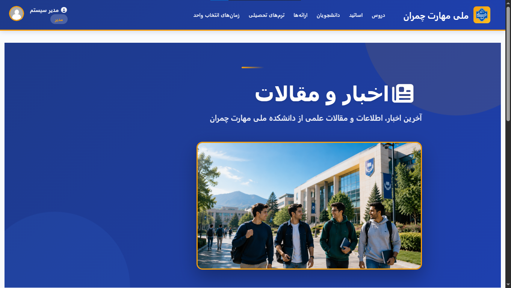
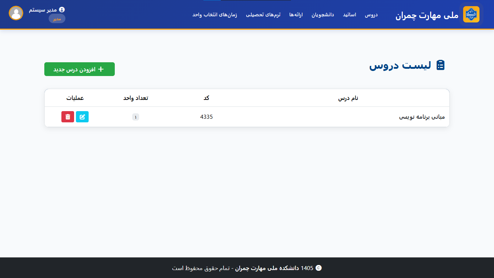

# ملی‌مهارت

این یک پروژه سیستم مدیریت امور دانشگاه (ملی‌مهارت) است که در 2 سکوی وب (ASP.NET Core + React JS) و دسکتاپ (WPF) توسعه داده شده است. هدف از این پروژه ساخت سیستمی برای دانشگاه است که بتواند اعمال اصلی یک دانشگاه، اعم از ثبت نام دانشجو/استاد (توسط مسئول آموزش)، ثبت دروس جدید، افزودن دروس ارائه شده ترم، ثبت نمرات دانشجو، انتخاب واحد توسط دانشجو، و مشاهده اطلاعات دانشجو همچون معدل و نمرات دروس می‌باشد.

## 📸 اسکرین‌شات‌ها (لایه Web MVC)

در ادامه برخی از تصاویر بخش‌های مختلف سامانه ملی‌مهارت نمایش داده شده‌اند، شامل صفحهٔ اصلی (Landing Page) و پنل مدیریت.

### 🖥️ صفحهٔ اصلی

  

### 🛠️ پنل مدیریت

  

---

# راه‌اندازی

1. ابتدا پروژه را از گیت‌هاب دریافت کنید.
2. سپس می‌توانید با بازکردن فایل سولوشن برنامه در ویژوال استودیو، به کد منبع دسترسی داشته باشید.
3. اگر می‌خواهید پروژه را اجرا کنید ابتدا بررسی کنید که SQL Server در دستگاه شما نصب باشد. سپس می‌توانید دیتابیس را به‌روزرسانی کنید.

# مشارکت

تشکر ویژه دارم از همکار عزیزم [آقای جرجانی](https://github.com/migueljocode) که در توسعه زیرساخت و نسخه دسکتاپ پروژه همکاری کردند.

# لایسنس

این پروژه تحت لایسنس [GPL](LICENSE) ارائه شده است.
