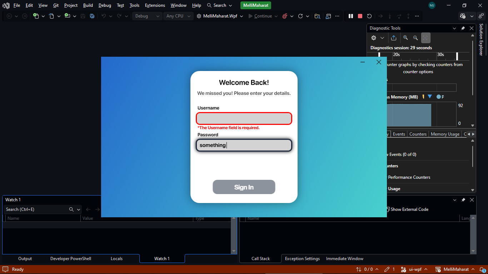
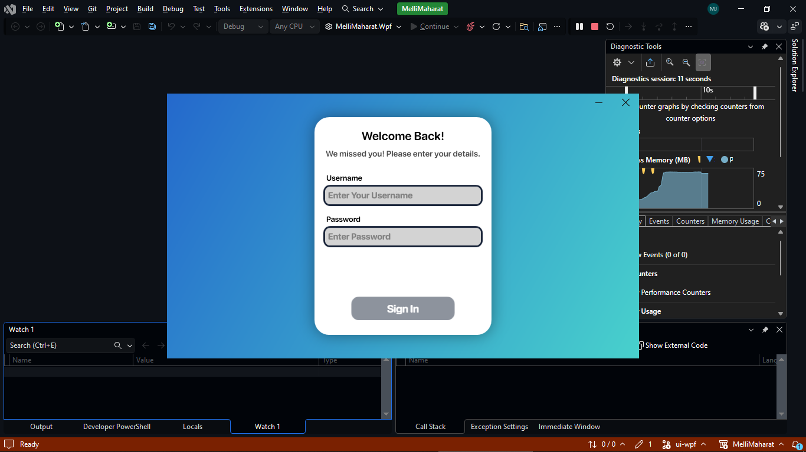
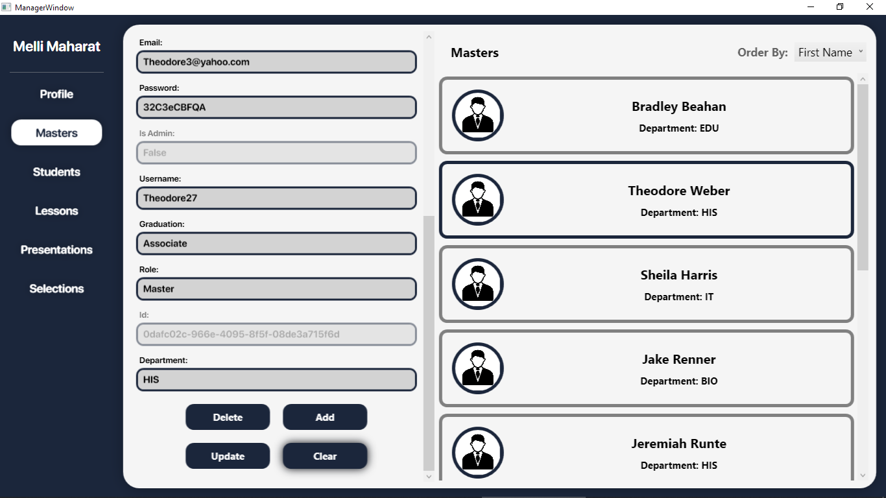
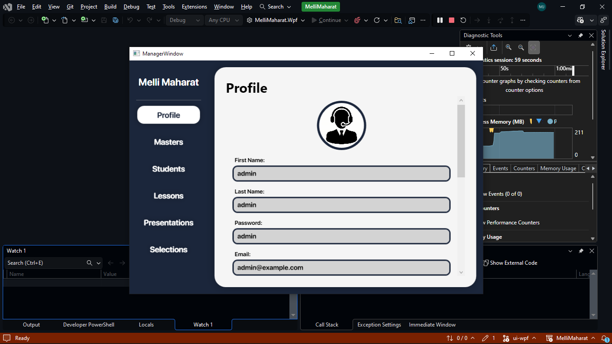
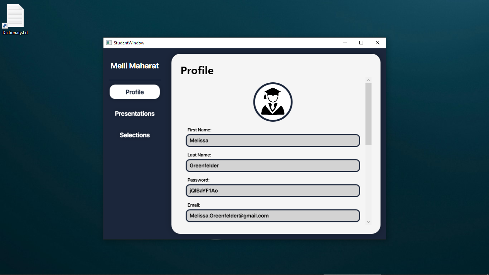
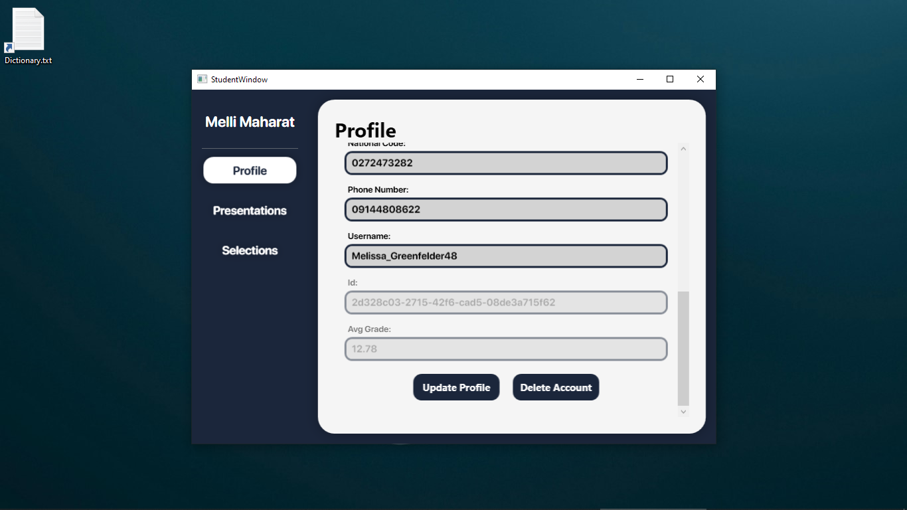
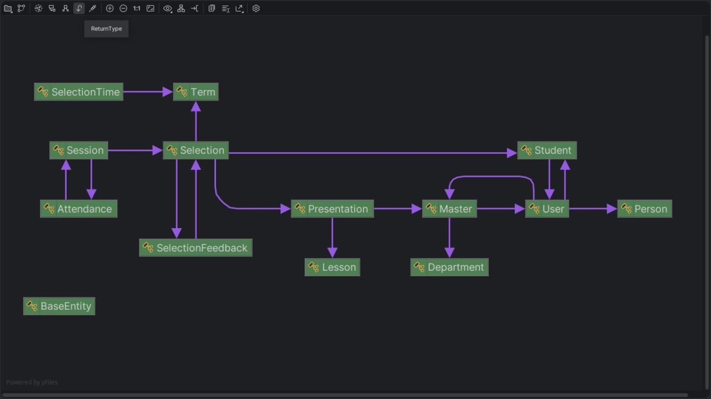
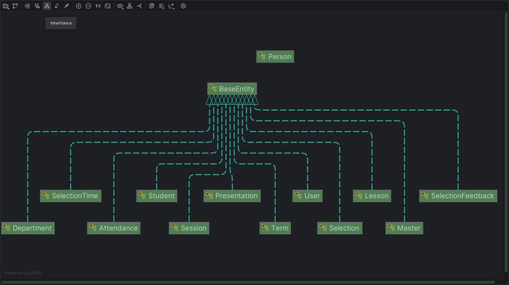

# ملی‌مهارت

این یک پروژه سیستم مدیریت امور دانشگاه (ملی‌مهارت) است که در 2 سکوی وب (ASP.NET Core + React JS) و دسکتاپ (WPF) توسعه داده شده است. هدف از این پروژه ساخت سیستمی برای دانشگاه است که بتواند اعمال اصلی یک دانشگاه، اعم از ثبت نام دانشجو/استاد (توسط مسئول آموزش)، ثبت دروس جدید، افزودن دروس ارائه شده ترم، ثبت نمرات دانشجو، انتخاب واحد توسط دانشجو، و مشاهده اطلاعات دانشجو همچون معدل و نمرات دروس می‌باشد.

#
اسکرین شات ها از محیط نرم افزار
## Authentication-Page


## Manager-Page


## Student-Page


# دیاگرام ها
## Has-A Relationship

## Is-A Relationship


# راه‌اندازی

1. ابتدا پروژه را از گیت‌هاب دریافت کنید.
2. سپس می‌توانید با بازکردن فایل سولوشن برنامه در ویژوال استودیو، به کد منبع دسترسی داشته باشید.
3. اگر می‌خواهید پروژه را اجرا کنید ابتدا بررسی کنید که SQLServer در دستگاه شما نصب باشد. سپس می‌تواند به آپدیت دیتابیس اقدام کنید.
4. اگر نیاز به داده موقت فیک دارید میتوانید به MelliMaharat.Tests مراجعه کنید
    1. توجه داشته باشید که برای اجرای MelliMaharat.Tests دفعه اول باید فقط یک بار InitializeDatabase را تست کنید و دفعات بعدی بدون استفاده از InitializeDatabase باید بقیه تست ها را اجرا کنید در غیر این صورت با خطا مواجه خواهید شد.
# کوئری های نمونه
```sql
-- Students
SELECT
    u.PersonInformation_FirstName,
    u.PersonInformation_LastName, 
    u.Username, 
    u.[Password],
    s.IsDeleted as 'deleted'
FROM Students s 
    INNER JOIN Users u 
        ON s.UserId = u.Id

-- Masters
SELECT 
    m.Id,
    m.Graduation,
    u.PersonInformation_FirstName as 'First Name', 
    u.PersonInformation_LastName as 'Last Name', 
    u.Username, 
    u.[Password], 
    d.Name as Department 
FROM Masters m 
    INNER JOIN Users u 
        ON u.Id = m.UserId 
    INNER JOIN Departments d 
        on  d.Id = m.DepartmentId

-- Lessons
SELECT Lessons.Name FROM Lessons WHERE Lessons.IsDeleted = 0

-- Admin Users
SELECT * FROM Users WHERE Users.Username = 'admin' 

-- Users
SELECT * FROM Users

-- Departments
SELECT * FROM Departments ORDER BY Name

--  Lessons
SELECT * FROM Lessons

-- Presentations
SELECT
    u.Username,
    u.[Password],
    p.Id as 'Presentation-Id',
    u.PersonInformation_FirstName as 'First Name',
    u.PersonInformation_LastName as 'Last Name',
    l.Name as 'Lesson Name',
    p.IsDeleted as 'P-Deleted',
    u.IsDeleted as 'U-Deleted',
    l.IsDeleted as 'L.deleted'
FROM Presentations p
    INNER JOIN Masters m
        ON m.Id = p.MasterId
        INNER JOIN Users u
            ON u.Id = m.UserId
    INNER JOIN Lessons l
        ON l.Id = p.LessonId
WHERE p.IsDeleted = 0 AND u.IsDeleted = 0 AND l.IsDeleted = 0 

-- Selections
SELECT
    u.PersonInformation_FirstName as 'Stu-FirstName',
    u.PersonInformation_LastName as 'Stu-LastName',
    u.Username as 'Stu-Username',
    u.[Password] as 'Stu-Password',
    p.Id as 'Presentation Id'
FROM Selections s
    INNER JOIN Students stu
        ON stu.Id = s.StudentId
            INNER JOIN Users u 
                ON u.Id = stu.UserId
    INNER JOIN Presentations p 
        ON p.Id = s.PresentationId

-- Terms
SELECT * FROM Terms

-- Specific Master Lesson Nmaes
SELECT 
    l.Name 
FROM Lessons l 
    INNER JOIN Presentations p 
        on p.LessonId = l.Id 
    INNER JOIN Masters m 
        on p.MasterId = m.Id 
    INNER JOIN Users u 
        on u.Id = m.UserId 
WHERE m.Id = 'b88fb030-3fb1-4d89-0db0-08de371ef142'
```

# مشارکت

تشکر ویژه دارم از همکار عزیزم [آقای نظرخانی](https://github.com/itsnazarkhani) که در کار توسعه زیرساخت و نسخه وب پروژه همکاری کردند.

# لایسنس

این پروژه تحت لایسنس [GPL](/LICENSE) ارائه شده است.
